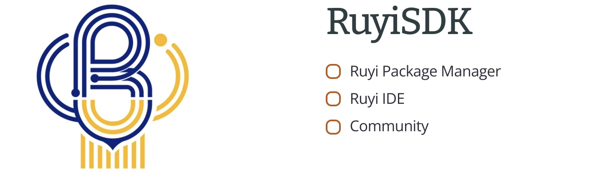

# A Visible [Future](http://ruyisdk.org/) of RISC-V Development

## What is RuyiSDK

The RuyiSDK is an open-source project started by the Chinese Academy of Sciences (ISCAS), developed by Programming Language and Compilation Technology Lab (PLCT Lab).

This project Focusing on provide RISC-V developers with a easy and comprehensive way to doing development on RISC-V.

## Why RuyiSDK

RuyiSDK now provides a brand new chance for RISC-V development.

In the past, developers working on the RISC-V architecture are facing lack of a complete development environment issue. So that's why we created RuyiSDK.  

- [x] Hard to get information of RISC-V
- [x] Incomplete Development Platform
- [x] Lack of a Related Community

That's all RuyiSDK have solved!

## These made RuyiSDK

| **RuyiSDK Component**                                      | **Status**                                                             |
| ---------------------------------------------------------- | ---------------------------------------------------------------------- |
| [RuyiSDK Package Manager](https://github.com/ruyisdk/ruyi) | [0.12.0 (latest)](https://github.com/ruyisdk/ruyi/releases/tag/0.12.0) |
| RuyiSDK IDE                                                | Planned (TODO)                                                         |
| Community                                                  | [Welcome!]((http://ruyisdk.org/))                                      |

## How Can I Get to RuyiSDK

1. [Documentation](https://ruyisdk.github.io/docs/zh/introduction/)
> Chinese Only, Planning English

2. Development
> Planning

3. [Issues for Ruyi Package Manager](https://github.com/ruyisdk/ruyi/issues)
> If you have any question about  Ruyi Package Manager, Click the link above to open a issue!
4. [Discussions]( https://github.com/ruyisdk/ruyisdk-website/discussions )
> Click the link above to discussion with others!

